# Data Mentorship — From Raw CSVs to Production Insight Pipelines

A 16-week curriculum for the **unsexy 80%** of every data project: the wrangling, cleaning, enrichment, validation, and orchestration that turns "we have a database" into "we have insights, reliably, on a schedule."

Most curricula skip this. ML curricula start at the model. BI courses start at the dashboard. The actual hard part — getting the data clean, joined, enriched, validated, and flowing — is left as an exercise. This one starts there.

## 🎯 Why this exists

You can train a state-of-the-art model on garbage data and get garbage answers. You can pay for a beautiful BI tool and produce reports nobody trusts. Both fail at the same step: **the data was not ready.**

This curriculum builds the discipline that fixes that:

- **SQL fluency** at a level most engineers never reach — window functions, CTEs, the patterns nobody teaches
- **Ingestion** from APIs, scrapes, files, streams — and the validation gates between them
- **Cleaning** that's reproducible — not "I cleaned it once in a notebook"
- **Enrichment** — joining external data, geocoding, embeddings — without polluting your inputs
- **Insights** that hold up — EDA done right, A/B testing without lying, dashboards people use
- **Pipelines** that survive Monday morning — Airflow / Dagster, dbt, CDC, modern data stack

By week 16 you'll have a working data pipeline running on a real schedule, with tests, observability, and a dashboard your stakeholders trust.

## 🧭 The arc

```mermaid
---
config:
  look: handDrawn
  theme: neutral
---
flowchart LR
    subgraph foundations["Foundations (01-04)"]
        direction TB
        W1["01 · SQL deep"]
        W2["02 · pandas + Polars"]
        W3["03 · Ingestion"]
        W4["04 · Data quality fundamentals"]
    end

    subgraph cleaning["Cleaning (05-08)"]
        direction TB
        W5["05 · Dedup + entity resolution"]
        W6["06 · Missing data + outliers"]
        W7["07 · Normalization + schema"]
        W8["08 · Text cleaning + fuzzy"]
    end

    subgraph enrichment["Enrichment (09-12)"]
        direction TB
        W9["09 · Joins at scale"]
        W10["10 · External enrichment"]
        W11["11 · Feature engineering"]
        W12["12 · Vector embeddings"]
    end

    subgraph insights["Insights + Production (13-16)"]
        direction TB
        W13["13 · EDA + statistics"]
        W14["14 · Causal + A/B"]
        W15["15 · Dashboards"]
        W16["16 · Production pipelines"]
    end

    foundations --> cleaning --> enrichment --> insights
```



## 📁 Curriculum

| ☐ | Week | Topic | What you'll do |
|---|------|-------|----------------|
| ☐ | 01 | [SQL deep](week-01-sql-deep) | Window functions, CTEs, the patterns nobody teaches. DuckDB-first; portable to Postgres/Snowflake. |
| ☐ | 02 | [pandas + Polars](week-02-pandas-and-polars) | Daily-driver tools. When each wins; how to think in expressions. |
| ☐ | 03 | [Ingestion](week-03-ingestion) | APIs, scraping, CSV/Parquet/JSON/Avro/Arrow. The honest file-format trade-offs. |
| ☐ | 04 | [Data quality fundamentals](week-04-data-quality-fundamentals) | Profiling, validation, Great Expectations / Soda / pandera. |
| ☐ | 05 | [Deduplication + entity resolution](week-05-deduplication-entity-resolution) | Exact vs fuzzy dedup; record linkage; splink. |
| ☐ | 06 | [Missing data + outliers](week-06-missing-data-outliers) | MCAR/MAR/MNAR; imputation strategies; when to leave outliers alone. |
| ☐ | 07 | [Normalization + schema enforcement](week-07-normalization-schema-enforcement) | Type coercion; Pydantic for tables; pandera; schema evolution. |
| ☐ | 08 | [Text cleaning + fuzzy matching](week-08-text-cleaning-fuzzy-matching) | Unicode hell; Levenshtein; rapidfuzz; lightweight NER. |
| ☐ | 09 | [Joins at scale](week-09-joins-at-scale) | Entity matching; geographic + temporal joins; broadcast vs shuffle. |
| ☐ | 10 | [External enrichment](week-10-external-enrichment) | Geocoding, demographics, public data sources. Ethics + rate limits. |
| ☐ | 11 | [Feature engineering](week-11-feature-engineering) | Classical features for tabular ML; categorical encoding; leakage. |
| ☐ | 12 | [Vector embeddings + semantic](week-12-vector-embeddings-semantic) | Text/image embeddings as columns; ANN indexing; semantic dedup. |
| ☐ | 13 | [EDA + statistical foundations](week-13-eda-statistical-foundations) | EDA beyond `df.describe()`; bootstrap; hypothesis tests done honestly. |
| ☐ | 14 | [Causal inference + A/B testing](week-14-causal-inference-ab-testing) | Randomized experiments; observational adjustment; common A/B mistakes. |
| ☐ | 15 | [Dashboards + storytelling](week-15-dashboards-and-storytelling) | Metabase / Superset; the visualization rules people skip. |
| ☐ | 16 | [Production data pipelines](week-16-production-pipelines) | Airflow / Dagster; dbt; CDC; the modern data stack glued together. |

## 📋 How each week works

Three files per week (same shape as the sibling curricula):

| File | Role |
|---|---|
| `readme.md` | What you'll learn this week, the lab setup, your assigned exercises, required reading |
| `theory.md` | The "why" — concepts, mental models, common-trap reference tables |
| `lab.md` | Guided exercises with verifiable output — every snippet runs on a laptop |

Solutions live in `solutions/` where the exercises have canonical answers.

## 🚀 Getting started

You'll do most of this curriculum on a laptop. No GPU required. The "production" weeks (15-16) optionally use a cheap VPS or your own machine; nothing exotic.

### Software

```bash
# Modern Python toolchain
curl -LsSf https://astral.sh/uv/install.sh | sh

# Project setup (week 02 covers this in full)
uv init
uv add duckdb polars pandas numpy matplotlib jupyter pyarrow pydantic
```

By the end of the curriculum you'll add (at most):

- `pandera`, `great-expectations`, or `soda-core` for data quality
- `splink` for entity resolution
- `rapidfuzz` for fuzzy string matching
- `sentence-transformers` for embeddings
- `dbt-core` + `dbt-duckdb` for transformation
- `dagster` or `airflow` for orchestration
- `metabase` or `superset` for dashboards

Everything is open source. No vendor lock-in. Skills transfer to Snowflake/BigQuery/Databricks etc. — they're SQL + Python with a UI on top.

### Data

The curriculum uses small, real, repeatable datasets:

- **NYC taxi trips** (~1 GB Parquet sample) — temporal, geographic, scale-relevant
- **Open Food Facts** — messy real-world catalog with deduplication challenges
- **NYC 311 service requests** — text-heavy with classification opportunities
- **GitHub Archive samples** — event streams for the pipeline weeks
- **Synthetic e-commerce** (we generate it) — for A/B testing and feature engineering

Total disk: ~10 GB. Most of it cached locally after week 03.

## 🎓 Learning philosophy

1. **Data first, model later.** The model is the easy part. Getting the data right is the work.
2. **Reproducible by default.** "I cleaned it once in a notebook" is not a deliverable. SQL + dbt + scripts under version control.
3. **Small, real, ugly.** Toy datasets teach toy lessons. The labs use small slices of real, messy data.
4. **Measure twice, drop once.** Every transformation should be auditable. If your CTE drops 12% of rows, you need to know why.
5. **Trust costs money.** A dashboard the team doesn't trust is worse than no dashboard. Honesty about quality is a feature.

## 📚 Reference shelf

Books to keep open across the curriculum:

- **The Data Warehouse Toolkit** — Kimball (the dimensional modeling reference)
- **Designing Data-Intensive Applications** — Kleppmann (the systems-level companion)
- **Statistical Rethinking** — McElreath (Bayesian-flavored stats; free YouTube lectures)
- **Trustworthy Online Controlled Experiments** — Kohavi, Tang, Xu (the A/B testing book)
- **Storytelling with Data** — Cole Nussbaumer Knaflic (the visualization reference)
- **Fundamentals of Data Engineering** — Reis & Housley (the modern-data-stack survey)

Free deep-dives:

- [Mode SQL tutorial](https://mode.com/sql-tutorial/) — windows + CTEs
- [DuckDB docs](https://duckdb.org/docs/) — the new standard local OLAP
- [dbt Learn](https://www.getdbt.com/learn) — vendor docs, but well-written
- [The Modern Data Stack](https://www.moderndatastack.xyz/) — tool landscape

## 🔗 Contributing

Built in the open. If you find an error in an exercise, a snippet that doesn't run on current package versions, or a better way to explain something, open a PR.

---

**Related curricula by the same author:**
- [django-mentorship](https://github.com/ichdamola/django-mentorship)
- [system-design-mentorship](https://github.com/ichdamola/system-design-mentorship)
- [appsec-mentorship](https://github.com/ichdamola/appsec-mentorship)
- [ml-mentorship](https://github.com/ichdamola/ml-mentorship)
